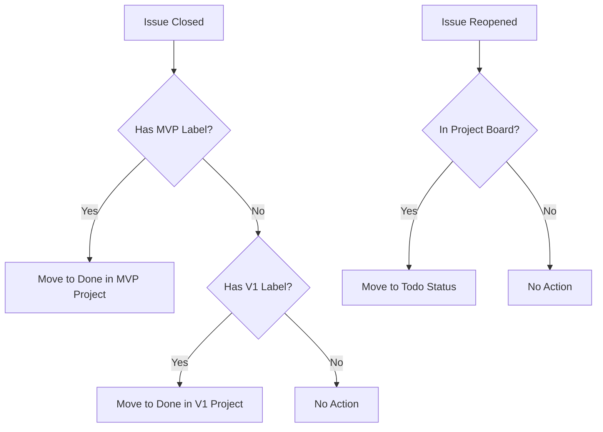

# Project Board Automation Setup

This directory contains automation workflows to keep GitHub Issues synchronized with Project Board status.

## 🔧 Setup Required

### 1. Create GitHub Personal Access Token

1. Go to GitHub Settings → Developer settings → Personal access tokens → Tokens (classic)
2. Generate new token with these scopes:
   - ✅ `repo` (Full control of private repositories)  
   - ✅ `project` (Full control of projects)
   - ✅ `read:org` (Read org and team membership)

### 2. Add Repository Secret

1. Go to Repository Settings → Secrets and variables → Actions
2. Click "New repository secret"
3. Name: `PROJECT_TOKEN`
4. Value: Your personal access token from step 1
5. Click "Add secret"

## 🚀 Workflows Included

### `sync-project-status.yml`
**Triggers:** When issues are closed/reopened
**Function:** Automatically moves project board items to Done/Todo status

**Features:**
- Real-time sync on issue state changes
- Separate handling for MVP vs V1 projects  
- Weekly backup sync to catch missed updates
- Smart label-based project detection

## 🎯 How It Works



## 🛠️ Manual Sync Script

For immediate sync or troubleshooting, use:

```bash
# Sync all closed MVP issues to Done
./scripts/sync-project-status.sh mvp

# Sync all closed V1 issues to Done  
./scripts/sync-project-status.sh v1

# Full sync both projects
./scripts/sync-project-status.sh all
```

## 🔍 Troubleshooting

**Workflow not running?**
- Check if `PROJECT_TOKEN` secret is set correctly
- Verify token has `project` scope
- Check workflow permissions in repository settings

**Items not syncing?**  
- Ensure issues have proper labels (`mvp` or `v1`)
- Check if items exist in the target project board
- Review workflow run logs for specific errors

## 📊 Project IDs Reference

- **MVP Project**: `PVT_kwHOBcvPe84BHzw0` (Project #1)
- **V1 Project**: `PVT_kwHOBcvPe84BHzxg` (Project #2)
- **Status Field**: `PVTSSF_lAHOBcvPe84BHzw0zg4dEuo`
  - Done: `98236657`
  - Todo: `f75ad846`
  - In Progress: `47fc9ee4`